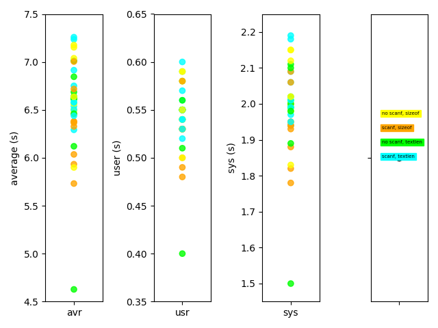

Mac は問題なさそう。

```
MacBook Pro (15-inch, 2018)
macOS Mojave Version 10.14.6

% cc --version
Apple clang version 11.0.0 (clang-1100.0.33.17)
Target: x86_64-apple-darwin18.7.0
Thread model: posix
InstalledDir: /Applications/Xcode-11.3.1.app/Contents/Developer/Toolchains/XcodeDefault.xctoolchain/usr/bin
```

1回実行



10回実行した平均


