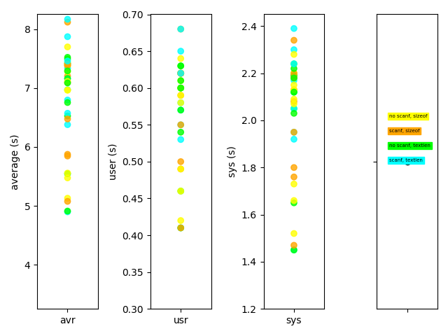
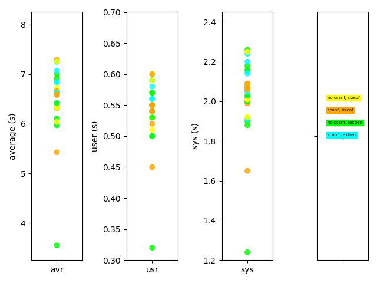
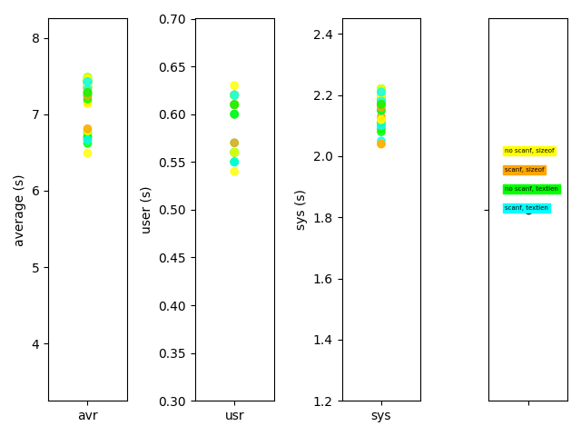
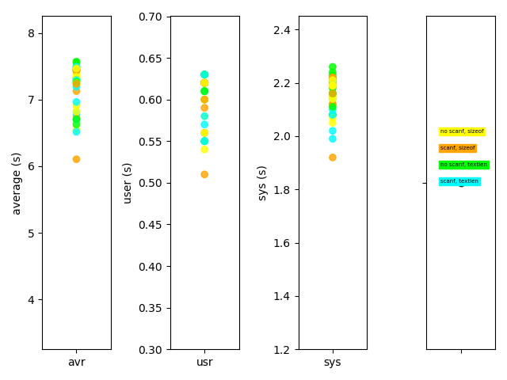
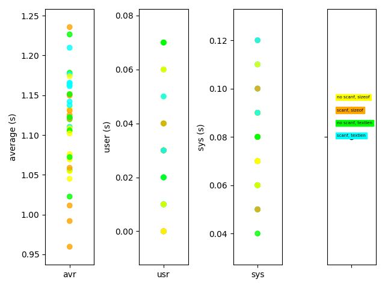
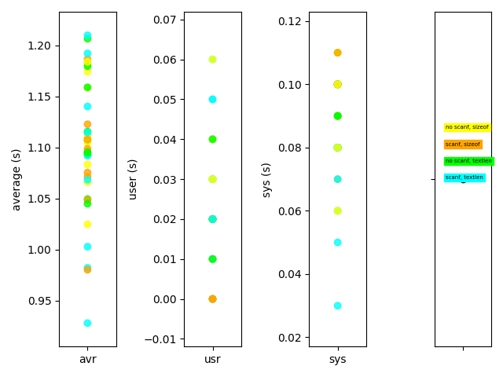
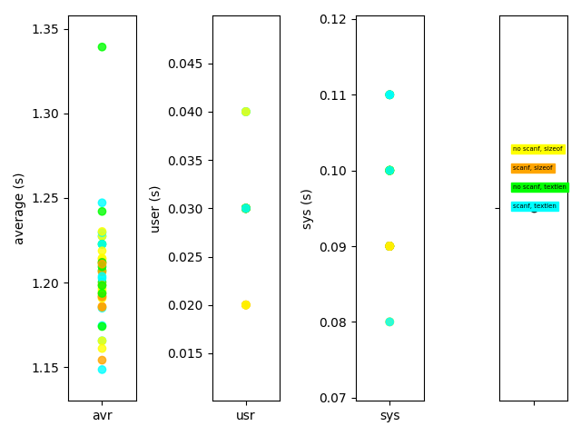
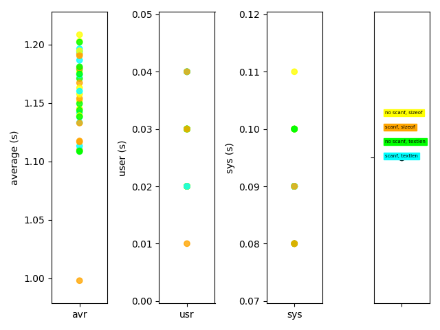

## MacBook Pro

```
MacBook Pro (15-inch, 2018)
macOS Mojave Version 10.14.6

% uname -srm
Darwin 18.7.0 x86_64

% cc --version
Apple clang version 11.0.0 (clang-1100.0.33.17)
Target: x86_64-apple-darwin18.7.0
Thread model: posix
InstalledDir: /Applications/Xcode-11.3.1.app/Contents/Developer/Toolchains/XcodeDefault.xctoolchain/usr/bin
```

1回実行




10回実行した平均




## Linux (VM)

```
VMware Fusion 11.5.0
Ubuntu 16.04.5 LTS

% uname -srm
Linux 4.4.0-47-generic x86_64

% cc --version
cc (Ubuntu 5.4.0-6ubuntu1~16.04.12) 5.4.0 20160609
Copyright (C) 2015 Free Software Foundation, Inc.
This is free software; see the source for copying conditions.  There is NO
warranty; not even for MERCHANTABILITY or FITNESS FOR A PARTICULAR PURPOSE.
```

1回実行




10回実行した平均




